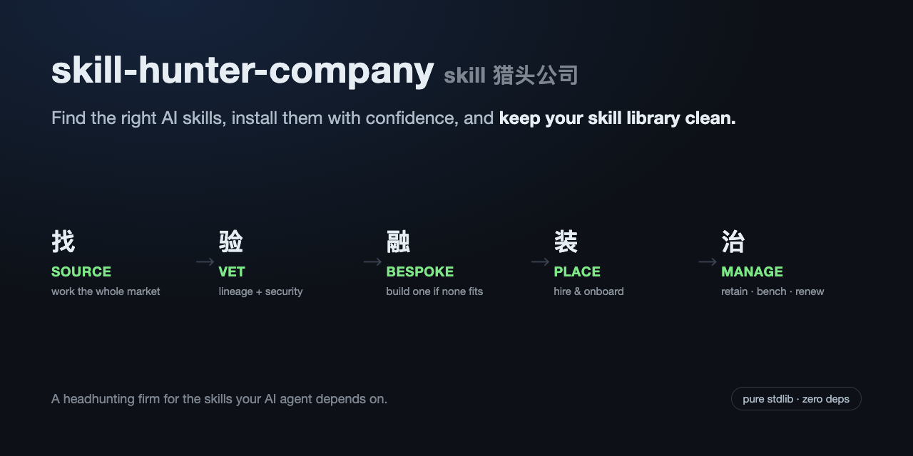
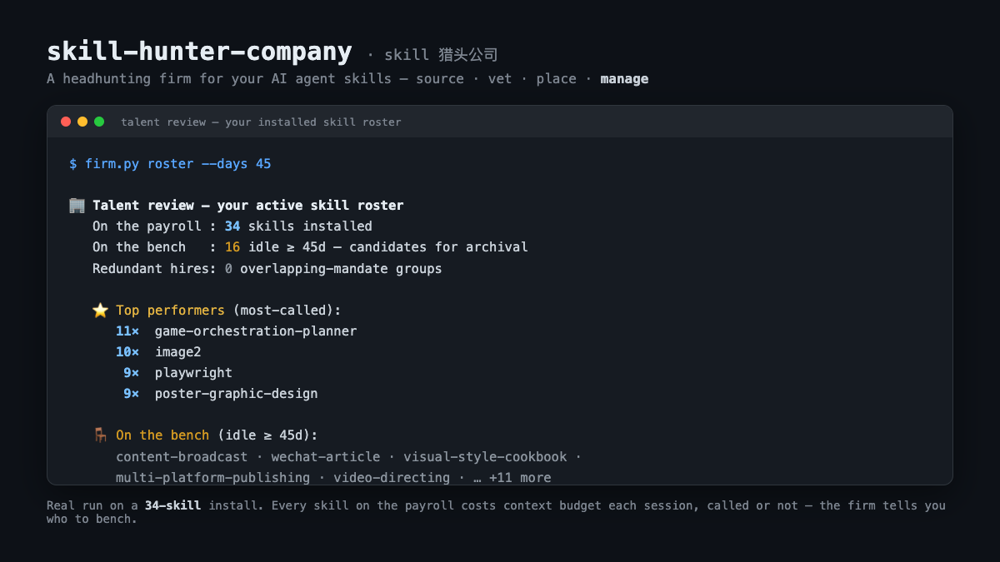
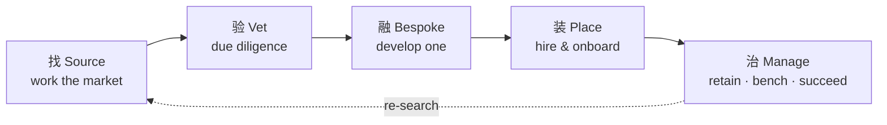

# skill-hunter-company · skill 猎头公司

> **Find the right AI skills, install them with confidence, and keep your skill library clean.**

[中文版 →](README.zh-CN.md)





A retained **headhunting firm for the skills your AI agent depends on.**

A good executive-search firm doesn't dump 15 résumés on your desk. It works the
market for you, hands you a short list of finalists it has already vetted, places
the right one — and then *keeps managing the talent* so your team doesn't quietly
rot. `skill-hunter-company` does exactly that for Claude Code / agent **skills**.

It is not "another skill search box." Search boxes give you a wall of look-alikes
ranked by stars and walk away. This firm runs the **full lifecycle** — and treats
every stage as a place where a hire can go wrong.

---

## Why a firm, not a search box

A skill goes through five gates between the moment you want it and the moment you're
sick of it. A search box walks you through the first gate and leaves; the other four
are on you, and each one is a place a hire goes wrong. Here's each gate, as a scene
at the firm.

**Source · 找**
You type "powerpoint" into the box and get a wall of near-identical results sorted by
stars. The one ranked seventh with thirty stars is a rewrite of the top result that
happens to fit you better — and you'll never scroll to it. A headhunter doesn't post a
job ad. They work the whole market and bring back the ones that never show up in search.

**Vet · 验**
You like a skill. Decent stars, author you've never heard of. Is it what it says it is,
or someone else's skill with a new coat of paint and a line of code that quietly phones
home? The fine print on the marketplace reads "no security review." A headhunter checks
the background first: who's the original, where it forked from, whether it has a record.
The candidates that don't clear it, you never meet.

**Bespoke · 融**
Sometimes you reach the bottom of the list and find three half-fits and nothing whole.
Settle for the closest, or build one yourself? Here the headhunter says: there's no right
person on the market, so we'll make one — take the best of each and combine them.

**Place · 装**
Picked one. The rest is easy, right? Getting them in the door is just the start.
Installing a skill is trivial; installing the right one, cleanly, with no surprises, is not.

**Manage · 治**
A year ago you hired a batch of skills and never looked at them again. Your former
favorite is three upstream versions behind; the bench is full of skills that have never
once been called, plus a few pairs doing the same job — each drawing a context-budget
paycheck every session. Nobody tells you who to let go. Unless you hired the firm that
watches the roster.

A search box barely covers "find." The other four gates are on you. A firm covers all five.

---

## What you actually get (real runs)

**Source the market for a need** — copies folded into one candidate, no padded list:

```
$ firm.py source "pptx powerpoint slides" --limit 6

🗂  Shortlist — 6 distinct candidates out of 6 sourced:
  1. ningzimu/image-to-editable-ppt-skill          ★581
  2. w1163222589-coder/slide-image-to-editable-pptx ★142
  3. Akxan/ppt-agent-skill                          ★83
  4. tristan-mcinnis/pptx-from-layouts-skill        ★75
  5. kdnsna/ultimate-ppt-master-skill              ★48
  6. Phlegonlabs/Powerpoint-fancy-design            ★26
```

**Review the team you already hired** — performance, bench strength, redundant hires:

```
$ firm.py roster --days 45

🏢 Talent review — your active skill roster
   On the payroll : 34 skills installed
   On the bench   : 16 idle ≥ 45d — candidates for archival
   Redundant hires: 0 overlapping-mandate groups

   ⭐ Top performers (most-called):
        11×  game-orchestration-planner
        10×  image2
         9×  playwright
   🪑 On the bench (idle ≥ 45d):
      • content-broadcast        never called
      • wechat-article           never called
      • visual-style-cookbook    never called
      …
```

> Numbers above are from a real install of 34 skills. Every skill on the payroll
> costs context budget each session, called or not — the firm tells you who to bench.

---

## The engagement



| Stage | Headhunting term | What it does | Department |
|---|---|---|---|
| **找 Source** | sourcing / talent mapping | search across sources, fold copies into one candidate, headhunt low-star improvements star-sorting hides | `world-aid` |
| **验 Vet** | due diligence / reference check | trace lineage (original vs fork vs re-skinned clone), security background check | `skill-lineage` (+ SkillSpector/OSV) |
| **融 Bespoke** | bespoke search / develop the talent | no whole candidate? extract the best mechanism from each and build one | `skill-fusion` |
| **装 Place** | placement / onboarding | make the offer — install and smoke-test | `world-aid` |
| **治 Manage** | retention / bench strength / succession | track performance, flag stale & overlapping hires, bench the idle | this repo |

**Two ways to engage the firm:**
- **Default engagement** (most clients): `source → vet → place`. You need *a* skill; the firm finds, checks, and hires the right one.
- **Retained client** (power users): `roster → bespoke → (re)place`. The firm watches your whole roster over time — develops bespoke skills, retires the stale, keeps the bench deep.

---

## Engage the firm (quick start)

```bash
git clone https://github.com/a28939876-max/skill-hunter-company
cd skill-hunter-company

# 1. Bring the back-office departments online (fetches the sibling repos)
python3 ensure_firm.py

# 2. Work the market for what you need (use tight keywords, not a sentence)
python3 firm.py source "pptx powerpoint slides"

# 3. Background-check a finalist, then make the hire
python3 firm.py vet  ningzimu/image-to-editable-ppt-skill
python3 firm.py place https://github.com/ningzimu/image-to-editable-ppt-skill
```

Pure Python stdlib, zero install. Anonymous works out of the box;
set `GITHUB_TOKEN` (and `SKILLSMP_API_KEY`) to lift rate limits and unlock full
lineage background checks.

---

## Without a firm vs with the firm

| | A search box | skill-hunter-company |
|---|---|---|
| **Finding** | a wall of look-alikes by star count | a short list, copies folded into one, low-star improvements surfaced |
| **Trust** | install and pray | due-diligence dossier: lineage + security before you ever meet a bad hire |
| **No perfect fit** | settle for the closest | commission a bespoke skill from the best parts |
| **After hiring** | forgotten | ongoing talent management — bench the idle, retire the redundant, follow upstream |
| **Your context budget** | bloats silently | the firm tells you exactly who to let go |

---

## The departments (a constellation, not a monolith)

This firm is an **orchestrator**. Each department is a standalone open-source
project with its own sharp focus — you can hire the whole firm, or just one desk:

- **[world-aid](https://github.com/a28939876-max/world-aid)** — *sourcing & placement.* The lightweight find-and-install engine.
- **[skill-lineage](https://github.com/a28939876-max/skill-lineage)** — *due diligence.* Lineage, fork/mirror/clone detection, the background-check desk.
- **skill-fusion** — *bespoke search.* Extract-and-rewrite mechanisms into one new skill (four manual quality gates).
- **SkillSpector / OSV** — *security backend.* We don't reinvent the scanner; we use the best one as a policy signal.

`world-aid = lightweight find+install engine. skill-hunter-company = the complete lifecycle firm.`

### The family
Built and shipped alongside its siblings:
**[world-aid](https://github.com/a28939876-max/world-aid)** (find+install) ·
**[skill-lineage](https://github.com/a28939876-max/skill-lineage)** (lineage) ·
**[world-intro](https://github.com/a28939876-max/world-intro)** (the open-source launch pipeline that shipped all of these).

---

## Honest notes

- **Use keywords, not sentences.** `source "pptx powerpoint slides"` works; a full
  natural-language sentence under-recalls (a hard lesson from the sourcing engine).
- **Sources degrade gracefully.** Aggregator down or rate-limited? The firm reports
  it and carries on with whatever desks are open — it never crashes the search.
- **Lineage needs a token.** Background checks hit the GitHub API; set `GITHUB_TOKEN`
  or you'll see `HTTP 403` and an empty dossier.
- **Who is this for?** If you install a handful of skills and move on, a search box is
  enough. The firm earns its keep when you run a *roster* — many skills, over time,
  where provenance, drift, and bloat actually cost you.

## License
MIT — see [LICENSE](LICENSE).
