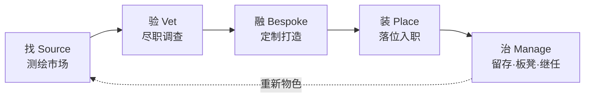

# skill-hunter-company · skill 猎头公司

> **帮你找对 skill、放心装上、并把整个 skill 团队长期管好。**

[English →](README.md)


一家为你 **AI agent 所依赖的 skill** 服务的 **猎头公司（高管猎聘 / executive search）**。

好的猎头公司不会甩给你 15 份简历，而是替你测绘市场、只交一份已经背调过的短名单、
把最对的那一个安置到位——然后**持续替你管理人才**，不让团队悄悄腐化。
`skill-hunter-company` 就是把这套搬给 Claude Code / agent 的 **skill**。

它**不是"又一个 skill 搜索框"**。搜索框只会按 star 甩给你一墙长得差不多的东西，然后转身就走。
这家公司管**完整生命周期**——并且把每个阶段都当成"一次招聘可能出错"的风险点来对待。

---

## 为什么要一家公司，而不是一个搜索框

一个 skill 从你看上它到你嫌弃它，中间要过五道关。搜索框只陪你走头一道，后面四道你自己扛。这五道关，每一道都是招人时容易栽跟头的地方，下面各讲一个公司里的场景。

**找 · Source**
你在框里敲"powerpoint"，刷出来一墙长得差不多的结果，按 star 从高到低排。排在第七、只有三十个 star 的那个，其实是把头名重写过一遍、更合你用的版本，可你翻不到它。猎头不在墙上挂广告。他把整个市场捋一遍，连那些根本没挂出来的也替你找回来。

**验 · Vet**
你看上一个 skill，star 不少，作者没听说过。它是它自己说的那个东西吗？还是把别人的 skill 换层皮、顺手塞了段往外回传数据的代码？市场页脚那行小字写着"我们不做安全审查"。猎头会先去查它的底：原版是谁、从哪儿 fork 来的、有没有案底。底没查清的人，你连面都见不着。

**融 · Bespoke**
有时候候选翻到底，三个各会一半，凑不出一个齐活的。将就用最像的，还是自己重头拼一个？这时候猎头会说：没有正好合适的，那就按你的要求攒一个，把这几个候选的长处挑出来，合成一个新的。

**装 · Place**
人选定了，往下就轻松了吧？把人请进门只是开头。装一个 skill 谁都会，装对版本、把权限收干净、别留一堆乱七八糟的依赖，才是另一码事。

**治 · Manage**
一年前你招了一批 skill，招完就没再管过。今天再看，当初最满意的那个，上游已经改了三版，你手里还是旧的。团队里还养着十来个从没被叫起来干过活的，外加好几对功能撞车的，每开一次工都照领一份上下文预算的薪水。没人提醒你该辞退谁，除非你请了那家专门帮你看名册的公司。

搜索框最多帮你把名字找出来，后面四道全甩给你。这四道，才是得有人替你盯着的。

---

## 你真正得到什么（真实跑出）

**按需求测绘市场**——同源拷贝归并成一个候选，绝不凑数：

```
$ firm.py source "pptx powerpoint slides" --limit 6

🗂  Shortlist — 6 distinct candidates out of 6 sourced:
  1. ningzimu/image-to-editable-ppt-skill          ★581
  2. w1163222589-coder/slide-image-to-editable-pptx ★142
  3. Akxan/ppt-agent-skill                          ★83
  4. tristan-mcinnis/pptx-from-layouts-skill        ★75
  5. kdnsna/ultimate-ppt-master-skill              ★48
  6. Phlegonlabs/Powerpoint-fancy-design            ★26
```

**盘点你已经雇下的团队**——绩效、板凳深度、重复编制：

```
$ firm.py roster --days 45

🏢 Talent review — your active skill roster
   在岗 On the payroll : 34 个 skill
   板凳 On the bench   : 16 个闲置 ≥ 45 天 — 建议归档
   重复 Redundant hires: 0 组职责重叠

   ⭐ 绩效前列（被调用最多）:
        11×  game-orchestration-planner
        10×  image2
         9×  playwright
   🪑 板凳席（闲置 ≥ 45 天）:
      • content-broadcast        从未调用
      • wechat-article           从未调用
      …
```

> 上面的数字来自一份真实的 34 个 skill 的安装。**在岗的每个 skill，不管调没调用，
> 每次会话都在吃上下文预算**——公司会告诉你该让谁下板凳。

---

## 完整流程



| 阶段 | 猎头术语 | 干什么 | 部门 |
|---|---|---|---|
| **找 Source** | sourcing / talent mapping | 跨源搜索、同源拷贝归并、猎回 star 排序埋没的改良版 | `world-aid` |
| **验 Vet** | due diligence / reference check | 查血统（原版 vs fork vs 换皮克隆）、安全背调 | `skill-lineage`（+ SkillSpector/OSV） |
| **融 Bespoke** | bespoke search / develop the talent | 没有完整人选？从各候选提炼最佳机制，打造一个 | `skill-fusion` |
| **装 Place** | placement / onboarding | 发 offer——安装并冒烟 | `world-aid` |
| **治 Manage** | retention / bench strength / succession | 盯绩效、揪出陈旧与重复、闲置下板凳 | 本仓 |

**两种委托方式：**
- **默认委托**（大众）：`找 → 验 → 装`。你需要*一个* skill，公司替你找对、查清、雇下。
- **长期客户**（power user）：`治 → 融 → 重新落位`。公司长期盯着你的整个团队——定制打造、汰换陈旧、把板凳养厚。

---

## 委托这家公司（快速开始）

```bash
git clone https://github.com/a28939876-max/skill-hunter-company
cd skill-hunter-company

# 1. 让后台各部门就位（取回姊妹仓）
python3 ensure_firm.py

# 2. 按需求测绘市场（用紧凑关键词，别用整句）
python3 firm.py source "pptx powerpoint slides"

# 3. 给一个 finalist 做背调，再雇下
python3 firm.py vet  ningzimu/image-to-editable-ppt-skill
python3 firm.py place https://github.com/ningzimu/image-to-editable-ppt-skill
```

纯 Python stdlib，零安装。匿名即可用；设 `GITHUB_TOKEN`（与 `SKILLSMP_API_KEY`）
可解除限流并解锁完整的谱系背调。

---

## 没有公司 vs 有了公司

| | 一个搜索框 | skill 猎头公司 |
|---|---|---|
| **找** | 按 star 甩一墙长得差不多的 | 一份短名单，拷贝归并，低星改良版被顶上来 |
| **信任** | 装上、祈祷 | 背调档案：见到坏人选之前先查血统 + 安全 |
| **没有完美人选** | 凑合用最接近的 | 从最佳零件定制打造一个 |
| **雇完之后** | 忘了 | 持续人才管理——闲置下板凳、重复退场、跟随上游 |
| **你的上下文预算** | 悄悄膨胀 | 公司明确告诉你该放谁走 |

---

## 各部门（constellation，不是单体）

这家公司是个**编排器**。每个部门都是各有专攻的独立开源项目——你可以雇整家公司，也可以只用一个台子：

- **[world-aid](https://github.com/a28939876-max/world-aid)** —— *搜罗与落位*。轻量的找-装引擎。
- **[skill-lineage](https://github.com/a28939876-max/skill-lineage)** —— *尽职调查*。谱系、fork/镜像/克隆判别，背调台。
- **skill-fusion** —— *定制搜索*。提炼-重写机制成一个新 skill（四道人工质量门禁）。
- **SkillSpector / OSV** —— *安全后端*。我们不重造扫描器，而是把最好的那个当策略信号接进来。

`world-aid = 轻量找+装引擎；skill-hunter-company = 完整生命周期公司。`

### 家族
与姊妹项目一同打造、一同发布：
**[world-aid](https://github.com/a28939876-max/world-aid)**（找+装）·
**[skill-lineage](https://github.com/a28939876-max/skill-lineage)**（谱系）·
**[world-intro](https://github.com/a28939876-max/world-intro)**（把它们都开源出去的发布管线）。

---

## 诚实注记

- **用关键词，别用整句。** `source "pptx powerpoint slides"` 有货；一整句自然语言召回明显不足（搜罗引擎付过的学费）。
- **信源会优雅降级。** 聚合站挂了或被限流？公司会报一句、然后用还开着的台子继续——绝不让搜索崩掉。
- **谱系背调需要 token。** 背调走 GitHub API；不设 `GITHUB_TOKEN` 会见到 `HTTP 403` 和空档案。
- **谁该用它？** 只装几个 skill 用完即走，搜索框就够了。当你开始**运营一支 roster**——很多 skill、跨越时间、血统/漂移/膨胀真在让你掏成本时，这家公司才值回票价。

## 许可
MIT —— 见 [LICENSE](LICENSE)。
